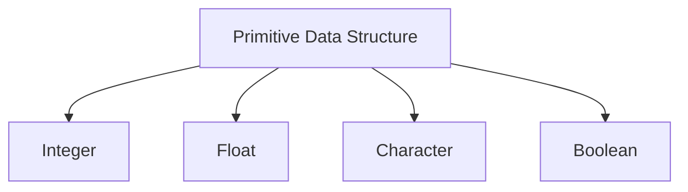
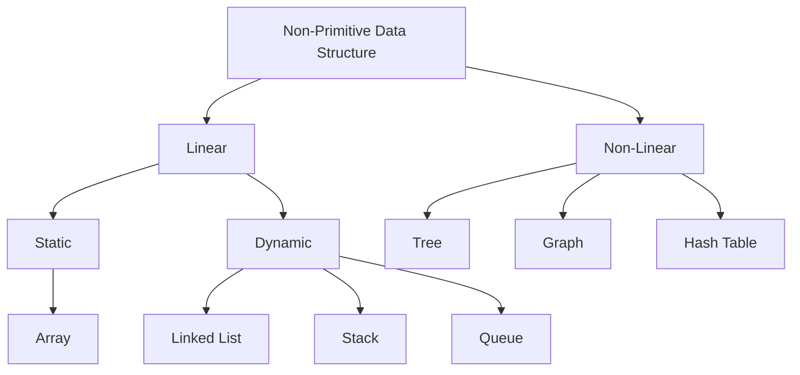

# 0x12. C - Singly linked lists
## Resources
[Data structure](https://www.geeksforgeeks.org/data-structures/)
[Linked Lists](https://www.youtube.com/watch?v=udapt4FGY20&t=130s&ab_channel=UNSWeLearning)

## Learning Objectives
<details>
<summary>Data Structures Classification</summary>

**Data structures** are the fundamental building blocks of computer programming. They define how data is organized, stored, and manipulated within a program. 
#### What is Data Structure?
A data structure is a storage that is used to store and organize data. It is a way of arranging data on a computer so that it can be accessed and updated efficiently.

A data structure is not only used for organizing the data. It is also used for processing, retrieving, and storing data. There are different basic and advanced types of data structures that are used in almost every program or software system that has been developed.
#### Primitive Data Structure

#### Non-Primitive Data Structure

# Non-Primitive Data Structures

| **Category**         | **Data Structure**    | **Description**                                                                                              | **Examples**                                                     |
|----------------------|-----------------------|--------------------------------------------------------------------------------------------------------------|------------------------------------------------------------------|
| **Linear (Static)**  | **Arrays**            | A collection of elements, stored in contiguous memory locations, where all elements are of the same data type. | `int arr[5] = {1, 2, 3, 4, 5};`                                |
| **Linear (Dynamic)** | **Linked List**       | A collection of nodes where each node contains a data element and a reference (or link) to the next node.      | `struct Node { int data; struct Node* next; };`               |
|                      | **Stacks**            | A linear data structure following the Last In, First Out (LIFO) principle, where elements are added and removed from the same end. | `push(int data);` and `pop();` functions                        |
|                      | **Queues**            | A linear data structure following the First In, First Out (FIFO) principle, where elements are added at the back and removed from the front. | `enqueue(int data);` and `dequeue();` functions                 |
| **Non-Linear**       | **Trees**             | A hierarchical data structure consisting of nodes, where each node has a value and pointers to its children.   | `struct TreeNode { int value; struct TreeNode* left; struct TreeNode* right; };` |
|                      | **Graphs**            | A collection of nodes (vertices) connected by edges. Graphs can be directed or undirected.                    | `struct Graph { int V; struct Node** adj; };`                  |
|                      | **Hash Tables**       | A data structure that maps keys to values using a hash function for efficient lookups.                         | `struct HashTable { int size; struct Node** table; };`        |

### Descriptions:

1. **Arrays**: 
   - A fixed-size, static data structure used to store elements of the same type.
   - **Example**: 
     ```c
     int arr[5] = {1, 2, 3, 4, 5};
     ```

2. **Linked List**: 
   - A dynamic data structure where each element (node) contains data and a reference to the next node, forming a chain.
   - **Example**: 
     ```c
     struct Node {
         int data;
         struct Node* next;
     };
     ```

3. **Stacks**: 
   - A linear data structure that follows the **LIFO (Last In, First Out)** principle. Elements are added and removed from the top of the stack.
   - **Example**: 
     ```c
     void push(int data);
     int pop();
     ```

4. **Queues**: 
   - A linear data structure that follows the **FIFO (First In, First Out)** principle. Elements are added at the rear and removed from the front.
   - **Example**: 
     ```c
     void enqueue(int data);
     int dequeue();
     ```

5. **Trees**: 
   - A hierarchical data structure consisting of nodes, with each node having zero or more children. The top node is called the root.
   - **Example**: 
     ```c
     struct TreeNode {
         int value;
         struct TreeNode* left;
         struct TreeNode* right;
     };
     ```

6. **Graphs**: 
   - A set of vertices (nodes) and edges connecting them. Graphs can be directed (with a direction between nodes) or undirected.
   - **Example**: 
     ```c
     struct Graph {
         int V;
         struct Node** adj; // adjacency list
     };
     ```

7. **Hash Tables**: 
   - A data structure that pairs keys to values for efficient lookups. A hash function maps each key to a unique index in an array.
   - **Example**: 
     ```c
     struct HashTable {
         int size;
         struct Node** table; // array of linked lists
     };
     ```
</details>
<details>
<summary>When and why using linked lists vs arrays</summary>

| **Criteria**                | **Linked Lists**                                           | **Arrays**                                                |
|-----------------------------|-----------------------------------------------------------|-----------------------------------------------------------|
| **Dynamic Size**            | Yes, can grow and shrink during runtime.                  | No, size is fixed upon declaration.                        |
| **Insertions/Deletions**    | Efficient, especially at the beginning or middle.        | Inefficient, as elements need to be shifted.              |
| **Memory Management**       | Allocates memory as needed, which can be more efficient.  | Requires pre-allocation of memory, leading to possible waste. |
| **Access Speed**            | Sequential access, O(n) time complexity for accessing.    | Direct access, O(1) time complexity for indexing.         |
| **Memory Overhead**         | Higher due to storage of pointers for each element.       | Lower, as it only stores the actual elements.             |
| **Cache Performance**       | Poor locality of reference; less cache-friendly.          | Better cache performance due to contiguous memory allocation. |
| **Use Case**                | Preferred for dynamic collections and frequent updates.    | Preferred for static collections with frequent access.     |

#### Summary
- Use **linked lists** when you need dynamic sizing and frequent insertions or deletions.
- Use **arrays** when you need fast random access, lower memory overhead, and when the size of the collection is known and stable
</details>
<details>
<summary>How to build and use linked lists</summary>

### Building and Using Linked Lists in C

Building and using linked lists involves defining a node structure, creating functions to manipulate the linked list (such as insertion, deletion, and traversal), and implementing those functions in your code. Below is a step-by-step guide on how to do this in C.

#### Step 1: Define the Node Structure

A linked list is made up of nodes, where each node contains data and a pointer to the next node.

```c
#include <stdio.h>
#include <stdlib.h>

// Define a node structure
struct Node {
    int data;          // Data part of the node
    struct Node* next; // Pointer to the next node
};
```
#### Step 2: Create Functions for Linked List Operations
You will need several functions to manipulate the linked list:

**1. Create a New Node**
A function to create and initialize a new node.
```c
struct Node* createNode(int data) {
    struct Node* newNode = (struct Node*)malloc(sizeof(struct Node)); // Allocate memory for a new node
    newNode->data = data; // Set the data
    newNode->next = NULL; // Initialize the next pointer to NULL
    return newNode;       // Return the new node
}
```
**2. Insert at the Beginning**
A function to insert a node at the beginning of the linked list.
```c
void insertAtBeginning(struct Node** head, int data) {
    struct Node* newNode = createNode(data); // Create a new node
    newNode->next = *head;                    // Link the new node to the current head
    *head = newNode;                           // Update the head to the new node
}
```
**3. Insert at the End**
A function to insert a node at the end of the linked list.
```c
void insertAtEnd(struct Node** head, int data) {
    struct Node* newNode = createNode(data); // Create a new node
    if (*head == NULL) {                      // If the list is empty
        *head = newNode;                      // Set the head to the new node
        return;
    }
    struct Node* temp = *head;                // Temporary pointer to traverse the list
    while (temp->next != NULL) {              // Traverse to the last node
        temp = temp->next;
    }
    temp->next = newNode;                     // Link the new node to the last node
}
```
**4. Delete a Node**
A function to delete a node by value.
```c
void deleteNode(struct Node** head, int key) {
    struct Node* temp = *head;                // Temporary pointer to traverse the list
    struct Node* prev = NULL;                  // Pointer to keep track of the previous node

    // If the head node holds the key to be deleted
    if (temp != NULL && temp->data == key) {
        *head = temp->next;                    // Change the head
        free(temp);                            // Free the old head
        return;
    }

    // Traverse the list to find the key
    while (temp != NULL && temp->data != key) {
        prev = temp;                           // Store the previous node
        temp = temp->next;                    // Move to the next node
    }

    // If the key was not found
    if (temp == NULL) return;

    prev->next = temp->next;                  // Unlink the node from the list
    free(temp);                               // Free the memory of the node
}
```
**5. Traverse the Linked List**
A function to print all the nodes in the linked list.
```c
void traverse(struct Node* head) {
    struct Node* temp = head;                 // Temporary pointer to traverse the list
    while (temp != NULL) {                    // While there are nodes left
        printf("%d -> ", temp->data);         // Print the data of the current node
        temp = temp->next;                    // Move to the next node
    }
    printf("NULL\n");                         // Indicate the end of the list
}
```
#### Step 3: Use the Linked List
In your main function, you can create and manipulate the linked list using the functions you've defined.
```c
int main() {
    struct Node* head = NULL; // Initialize the head of the linked list

    // Insert elements
    insertAtBeginning(&head, 3);
    insertAtBeginning(&head, 2);
    insertAtBeginning(&head, 1);
    insertAtEnd(&head, 4);
    insertAtEnd(&head, 5);

    printf("Linked List: ");
    traverse(head); // Print the linked list

    // Delete a node
    deleteNode(&head, 3);
    printf("After deleting 3: ");
    traverse(head); // Print the linked list again

    return 0;
}
```
#### Summary
This implementation covers the basic operations of a singly linked list, including:

- Creating a new node
- Inserting nodes at the beginning and end
- Deleting a node by value
- Traversing and printing the linked list
</details>

## More Info
Please use this data structure for this project:
``` c
/**
 * struct list_s - singly linked list
 * @str: string - (malloc'ed string)
 * @len: length of the string
 * @next: points to the next node
 *
 * Description: singly linked list node structure
 */
typedef struct list_s
{
    char *str;
    unsigned int len;
    struct list_s *next;
} list_t;
```
## Tasks
### 0. Print list
Write a function that prints all the elements of a ``list_t`` list.

**Prototype:** size_t ``print_list(const list_t *h);``
- Return: the number of nodes
- Format: see example
- If ``str`` is ``NULL``, print ``[0] (nil)``
- You are allowed to use ``printf``
```bash
$ cat 0-main.c
#include <stdlib.h>
#include <string.h>
#include <stdio.h>
#include "lists.h"

/**
 * main - check the code
 *
 * Return: Always 0.
 */
int main(void)
{
    list_t *head;
    list_t *new;
    list_t hello = {"World", 5, NULL};
    size_t n;

    head = &hello;
    new = malloc(sizeof(list_t));
    if (new == NULL)
    {
        printf("Error\n");
        return (1);
    }
    new->str = strdup("Hello");
    new->len = 5;
    new->next = head;
    head = new;
    n = print_list(head);
    printf("-> %lu elements\n", n);

    printf("\n");
    free(new->str);
    new->str = NULL;
    n = print_list(head);
    printf("-> %lu elements\n", n);

    free(new);
    return (0);
}
$ gcc -Wall -pedantic -Werror -Wextra -std=gnu89 0-main.c 0-print_list.c -o a
$ ./a 
[5] Hello
[5] World
-> 2 elements

[0] (nil)
[5] World
-> 2 elements
```
### 1. List length
Write a function that returns the number of elements in a linked ``list_t`` list.

**Prototype:** ``size_t list_len(const list_t *h);``
``` bash
$ cat 1-main.c
#include <stdlib.h>
#include <string.h>
#include <stdio.h>
#include "lists.h"

/**
 * main - check the code
 *
 * Return: Always 0.
 */
int main(void)
{
    list_t *head;
    list_t *new;
    list_t hello = {"World", 5, NULL};
    size_t n;

    head = &hello;
    new = malloc(sizeof(list_t));
    if (new == NULL)
    {
        printf("Error\n");
        return (1);
    }
    new->str = strdup("Hello");
    new->len = 5;
    new->next = head;
    head = new;
    n = list_len(head);
    printf("-> %lu elements\n", n);
    free(new->str);
    free(new);
    return (0);
}
$ gcc -Wall -pedantic -Werror -Wextra -std=gnu89 1-main.c 1-list_len.c -o b
$ ./b 
-> 2 elements
```
### 2. Add node
Write a function that adds a new node at the beginning of a ``list_t`` list.

**Prototype:** ``list_t *add_node(list_t **head, const char *str);``
- Return: the address of the new element, or ``NULL`` if it failed
- ``str`` needs to be duplicated
- You are allowed to use ``strdup``
```bash
$ cat 2-main.c
#include <stdlib.h>
#include <string.h>
#include <stdio.h>
#include "lists.h"

/**
 * main - check the code
 *
 * Return: Always 0.
 */
int main(void)
{
    list_t *head;

    head = NULL;
    add_node(&head, "Alexandro");
    add_node(&head, "Asaia");
    add_node(&head, "Augustin");
    add_node(&head, "Bennett");
    add_node(&head, "Bilal");
    add_node(&head, "Chandler");
    add_node(&head, "Damian");
    add_node(&head, "Daniel");
    add_node(&head, "Dora");
    add_node(&head, "Electra");
    add_node(&head, "Gloria");
    add_node(&head, "Joe");
    add_node(&head, "John");
    add_node(&head, "John");
    add_node(&head, "Josquin");
    add_node(&head, "Kris");
    add_node(&head, "Marine");
    add_node(&head, "Mason");
    add_node(&head, "Praylin");
    add_node(&head, "Rick");
    add_node(&head, "Rick");
    add_node(&head, "Rona");
    add_node(&head, "Siphan");
    add_node(&head, "Sravanthi");
    add_node(&head, "Steven");
    add_node(&head, "Tasneem");
    add_node(&head, "William");
    add_node(&head, "Zee");
    print_list(head);
    return (0);
}
$ gcc -Wall -pedantic -Werror -Wextra -std=gnu89 2-main.c 2-add_node.c 0-print_list.c -o c
$ ./c 
[3] Zee
[7] William
[7] Tasneem
[6] Steven
[9] Sravanthi
[6] Siphan
[4] Rona
[4] Rick
[4] Rick
[7] Praylin
[5] Mason
[6] Marine
[4] Kris
[7] Josquin
[4] John
[4] John
[3] Joe
[6] Gloria
[7] Electra
[4] Dora
[6] Daniel
[6] Damian
[8] Chandler
[5] Bilal
[7] Bennett
[8] Augustin
[5] Asaia
[9] Alexandro
```  
### 3. Add node at the end
Write a function that adds a new node at the end of a ``list_t`` list.
**Prototype:** ``list_t *add_node_end(list_t **head, const char *str);``
- Return: the address of the new element, or ``NULL`` if it failed
- ``str`` needs to be duplicated
- You are allowed to use ``strdup``
```bash
$ cat 3-main.c
#include <stdlib.h>
#include <string.h>
#include <stdio.h>
#include "lists.h"

/**
 * main - check the code
 *
 * Return: Always 0.
 */
int main(void)
{
    list_t *head;

    head = NULL;
    add_node_end(&head, "Anne");
    add_node_end(&head, "Colton");
    add_node_end(&head, "Corbin");
    add_node_end(&head, "Daniel");
    add_node_end(&head, "Danton");
    add_node_end(&head, "David");
    add_node_end(&head, "Gary");
    add_node_end(&head, "Holden");
    add_node_end(&head, "Ian");
    add_node_end(&head, "Ian");
    add_node_end(&head, "Jay");
    add_node_end(&head, "Jennie");
    add_node_end(&head, "Jimmy");
    add_node_end(&head, "Justin");
    add_node_end(&head, "Kalson");
    add_node_end(&head, "Kina");
    add_node_end(&head, "Matthew");
    add_node_end(&head, "Max");
    add_node_end(&head, "Michael");
    add_node_end(&head, "Ntuj");
    add_node_end(&head, "Philip");
    add_node_end(&head, "Richard");
    add_node_end(&head, "Samantha");
    add_node_end(&head, "Stuart");
    add_node_end(&head, "Swati");
    add_node_end(&head, "Timothy");
    add_node_end(&head, "Victor");
    add_node_end(&head, "Walton");
    print_list(head);
    return (0);
}
$ gcc -Wall -pedantic -Werror -Wextra -std=gnu89 3-main.c 3-add_node_end.c 0-print_list.c -o d
$ ./d 
[4] Anne
[6] Colton
[6] Corbin
[6] Daniel
[6] Danton
[5] David
[4] Gary
[6] Holden
[3] Ian
[3] Ian
[3] Jay
[6] Jennie
[5] Jimmy
[6] Justin
[6] Kalson
[4] Kina
[7] Matthew
[3] Max
[7] Michael
[4] Ntuj
[6] Philip
[7] Richard
[8] Samantha
[6] Stuart
[5] Swati
[7] Timothy
[6] Victor
[6] Walton
```  
### 4. Free list
Write a function that frees a ``list_t`` list.

**Prototype:** ``void free_list(list_t *head);``
```bash
$ cat 4-main.c
#include <stdlib.h>
#include <string.h>
#include <stdio.h>
#include "lists.h"

/**
 * main - check the code
 *
 * Return: Always 0.
 */
int main(void)
{
    list_t *head;

    head = NULL;
    add_node_end(&head, "Bob");
    add_node_end(&head, "&");
    add_node_end(&head, "Kris");
    add_node_end(&head, "love");
    add_node_end(&head, "asm");
    print_list(head);
    free_list(head);
    head = NULL;
    return (0);
}
$ gcc -Wall -pedantic -Werror -Wextra -std=gnu89 4-main.c 4-free_list.c 3-add_node_end.c 0-print_list.c -o e
$ valgrind ./e
==3598== Memcheck, a memory error detector
==3598== Copyright (C) 2002-2015, and GNU GPL'd, by Julian Seward et al.
==3598== Using Valgrind-3.11.0 and LibVEX; rerun with -h for copyright info
==3598== Command: ./e
==3598== 
[6] Bob
[1] &
[3] Kris
[4] love
[3] asm
==3598== 
==3598== HEAP SUMMARY:
==3598==     in use at exit: 0 bytes in 0 blocks
==3598==   total heap usage: 11 allocs, 11 frees, 1,166 bytes allocated
==3598== 
==3598== All heap blocks were freed -- no leaks are possible
==3598== 
==3598== For counts of detected and suppressed errors, rerun with: -v
==3598== ERROR SUMMARY: 0 errors from 0 contexts (suppressed: 0 from 0)
```
### 5. The Hare and the Tortoise
Write a function that prints ``You're beat! and yet, you must allow,\nI bore my house upon my back!\n`` before the ``main`` function is executed.
You are allowed to use the ``printf`` function
```bash
$ cat 100-main.c
#include <stdio.h>

/**
 * main - check the code
 *
 * Return: Always 0.
 */
int main(void)
{
    printf("(A tortoise, having pretty good sense of a hare's nature, challenges one to a race.)\n");
    return (0);
}
$ gcc -Wall -pedantic -Werror -Wextra -std=gnu89 100-main.c 100-first.c -o first
$ ./first 
You're beat! and yet, you must allow,
I bore my house upon my back!
(A tortoise, having pretty good sense of a hare's nature, challenges one to a race.)
```
  
### 6. Real programmers can write assembly code in any language
Write a 64-bit program in assembly that prints ``Hello, Holberton``, followed by a new line.

- You are only allowed to use the ``printf`` function
- You are not allowed to use interrupts
- Your program will be compiled using ``nasm`` and ``gcc``:
```bash
$ nasm -f elf64 101-hello_holberton.asm && gcc -no-pie -std=gnu89 101-hello_holberton.o -o hello
$ ./hello 
Hello, Holberton
```